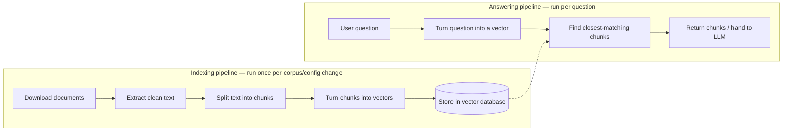
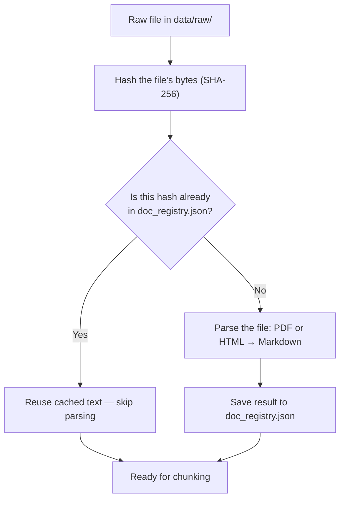
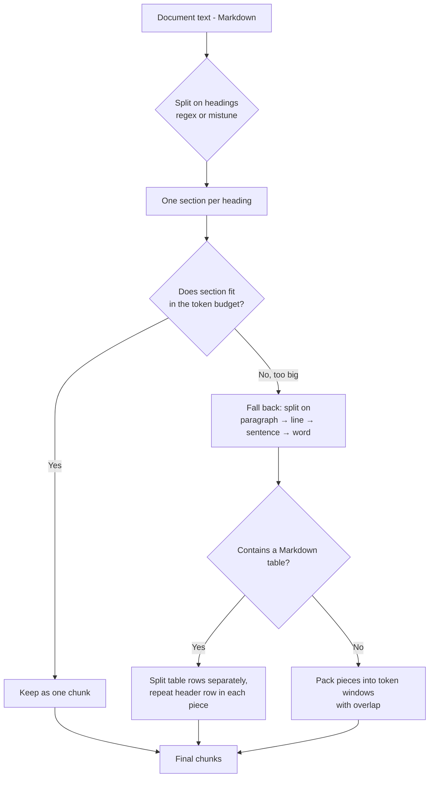
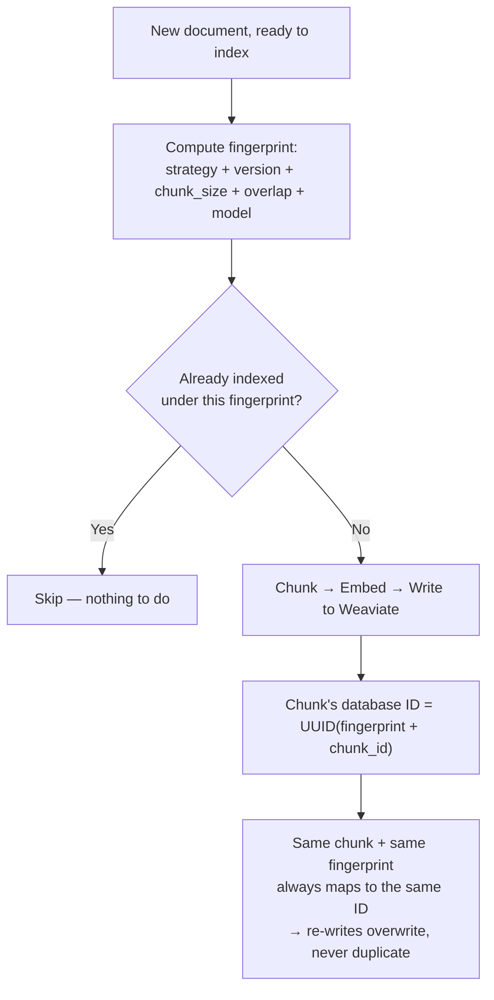

# RAG over Public Health Policy Documents

This project answers questions about U.S. health-policy documents (CMS,
HHS, and related public-health sources) by combining a search engine with
a language model — a pattern known as **RAG (Retrieval-Augmented
Generation)**.

Instead of asking a language model to answer purely from
what it memorized during training (which can be outdated or made up),
this project first **finds the exact passages** in a curated set of ~30
real documents that are relevant to the question, and then hands those
passages to the model so it answers using the actual source text.

## Why RAG instead of just asking a language model directly?

| Approach | Problem it avoids | Problem it introduces |
|---|---|---|
| Ask the model directly | — | Model may hallucinate, or not know about documents it never saw |
| Fine-tune the model on these documents | — | Expensive, slow to update, hard to trace an answer back to a source |
| **RAG (this project)** | Answers are grounded in real text, easy to update by adding new documents, and every answer can be traced to a source file | Answer quality depends entirely on whether the search step finds the right passages |

That last row is why most of this project's engineering effort goes into
the **search step** (chunking, embedding, retrieval) rather than the
final answer-generation step.

---

## The two pipelines

This project has two independent pipelines that run at very different
frequencies:

1. **Indexing** (`build_index`) — run once whenever the document set or
   the chunking/embedding settings change. This pipeline phase is  
   slower, it costs money due to using embedding API calls, it writes 
   to the vector database.
2. **Answering** (`answer_question`) — run every time user asks a
   question. This pipeline phase is fast, cheap, read-only.

Keeping them separate means that we are never re-processing the whole
document set just to test one new question.



---

## Step 1 — Fetch the documents (`scripts/fetch_corpus.py`)

**What it does:** Reads a list of URLs from `data/document-list.csv` and
downloads each file into `data/raw/`. If a file already downloaded and 
exists locally, then it's skipped and not re-downloaded again.

**Why it matters:** Keeping the download list in a CSV file (rather than
hardcoded URLs in the code) means adding a new source document is a
one-line edit, not a code change. 

**Small but important details:**
- Requests are spaced out by 1 second and identify themselves as a
  normal web browser (a "User-Agent" header), because some government
  sites block requests that look like an automated bot.
- Failed downloads (rate-limited, server errors) are retried a few times
  with increasing wait times, but a "403 Forbidden" is not retried.
  That means the server is deliberately refusing the request, and
  retrying won't change that.

**Alternative approaches considered:** hardcode file paths and skip
downloading (fine for a handful of files, but doesn't scale, and makes
it hard to refresh the corpus later); or download every time the
pipeline runs (wasteful, and slow if a site is down or one file
happens to have a long time out).

---

## Step 2 — Extract clean text (`src/ingest.py`)

This step converts each raw PDFs and HTML file into clean, readable text.

**PDF files** are handled with `pymupdf` + `pymupdf4llm`, which extract
text **as Markdown** (headings, lists, and tables are preserved with
`#`, `-`, and `|` syntax instead of being flattened into a wall of
text). Pages that contain no extractable text (i.e. the page is just a
scanned image) are detected and skipped rather than passed through OCR. 
We skipped OCR for this project because it wasn't needed for this corpus 
which had all official documents that are digitally generated, rather 
than being scanned.

**HTML files** are handled with `BeautifulSoup` to strip out boilerplate
tags (`<nav>`, `<footer>`, `<script>`, `<header>`, etc.) before handing
the remaining content to `html2text`, which converts it to the same
Markdown format the PDF path produces.

**Why Markdown, specifically:** Keeping both formats in a **single,
consistent output format** (Markdown) means every later step, 
especially chunking, can rely on one set of rules ("headings start with `#`",
"tables use `|`") regardless of whether the source was a PDF or a web
page.

**Alternative approaches considered:**
- *Plain text extraction* (no Markdown) — simpler, but throws away
  document structure, which later turned out to matter a lot for
  chunking quality (see Step 4).
- *`pdfplumber` or `docling` instead of `pymupdf4llm`* — both were
  evaluated. `pdfplumber` was fast but couldn't parse complex PDFs.
  Wheras `docling` processed complex PDFs very well but it was 
  substantially slower, even noticable with our small size of corpus.
  `pymupdf4llm` was kept because it produces Markdown directly and 
  handles this corpus's documents (fact sheets, tables, multi-column 
  layouts) well and ran about 8 times faster than `docling`.

### Avoiding duplicate work: content fingerprinting

Re-parsing a PDF is slow. If `load_corpus()` re-ran the full extraction
on every file every time, iterating on the pipeline would mean waiting
minutes for the exact same documents to be re-read again and again.

**What it does:** Every file gets a `doc_id` derived from a **SHA-256
hash of its raw bytes** (see `generate_content_doc_id()`), not from its
filename. That ID is looked up in `data/processed/doc_registry.json`,
a small JSON file that acts as a cache: `{doc_id: {extracted text,
metadata, ...}}`. If the ID is already in the registry, the cached text
is reused and the file is never re-opened or re-parsed.

**Why hash the content instead of using the filename or the "last
modified" timestamp:**
- **Filename** — breaks the moment a file gets renamed, even though
  nothing about its content changed, and doesn't catch it if someone
  silently replaces a file's content while keeping the same name.
- **Last-modified timestamp** — unreliable across different machines,
  cloud syncs, or git checkouts, all of which can touch a file's
  timestamp without touching its content.
- **Content hash (chosen)** — the same bytes always produce the same
  ID, so a file is correctly recognized as "already processed"
  regardless of its name or timestamp, and correctly recognized as
  "new" the moment its actual content changes.



---

## Step 3 — Split text into chunks (`src/chunker.py`)

A whole document is too big and too unfocused to search well or to feed
into a language model. We don't want the model reading a 40-page PDF
just to answer one question about a single paragraph. **Chunking**
breaks each document into smaller, self-contained pieces that get
embedded and searched individually.

This project supports **three chunking strategies**, selectable in
`src/config.py` (`CHUNKING_STRATEGY`):

1. **`naive_fixed_size`** — the simplest possible approach: encode the
   text into tokens (using the same tokenizer OpenAI's models use) and
   cut it into fixed-size windows, with a bit of overlap between
   consecutive windows so a sentence that straddles a cut point isn't
   completely lost from both sides. This approach is fast and predictable, 
   but a chunk boundary can land in the middle of a sentence, a table row, 
   or a heading, with no regard for what the text is actually about.

2. **`recursive_overlap_chunk`** — instead of cutting at a fixed token
   count no matter what, it tries to cut at natural boundaries first:
   paragraph breaks, then line breaks, then sentence endings, then
   words, only falling back to raw character splitting as a last
   resort. This produces chunks that read more naturally, at the cost
   of being slightly slower and more complex.

3. **`structure_aware_chunk`** (chosen) — splits the
   document at its actual Markdown headings first, so each chunk stays
   within one logical section of the document. A section that's
   still too big falls back to the same paragraph/sentence-aware
   splitting as strategy 2. It also has special handling for **Markdown
   tables**: a table that has to be split across chunks gets its header
   row repeated at the top of every subsequent chunks containing the table
   , so a chunk of table rows never loses the column labels that explain 
   what the value of the column mean.

**Why structure-aware chunking is chosen:** the documents in our corpus are
fact sheets and reports that are heavily organized by heading (state
names, program names, FAQ sections). A fixed-size window has no
awareness of the document structure will likely produce a chunk that 
contains part of contents of multiple section of the document. 
Whereas, the structure-aware chunks tries to retain the content of each
section separately, which helps preserve the complete and accurate context,
which in turn helps the semantec search to retreive chunks that are more 
cloely related to the question. The early evaluation of the retreival process 
have been documented in `tests/test_questions.md`. It shows the 10 preset 
questions used for the evaluation, their expected answer, the top 3 retreived 
chunks with each of the 3 chunking strategies, and their corresponding 
evaluation result.

#### **Key takeaway:**

Our evaluation showed that structure‑aware chunking generally performed the 
best, but even the strongest strategy can fail under certain conditions. 
A notable example is **Question 5** (see `tests/test_questions.md`), where 
structure‑aware chunking missed the correct answer while the fixed‑size 
and recursive strategies succeeded.

A root‑cause analysis revealed that the issue was not the chunking strategy 
itself, but **how the underlying PDF was ingested**. The document uses a 
**three‑column layout**, and during ingestion using **pymupdf4llm** the layout 
was flattened in a way that **separated headers from their associated content**. 
Because fixed‑size and recursive chunking operate with larger token windows, 
they were still able to capture enough relevant context. In contrast, structure‑aware 
chunking treated each column header as an isolated section with no content, 
and then split the column contents into separate chunks resulting in a 
mismatch between headers and the text needed to answer the question.

This surfaced two important lessons:
- **RAG is a team sport.** The final answer depends on the combined performance of 
ingestion, chunking, embedding, indexing, and retrieval. A weakness in one stage 
can degrade the effectiveness of the others.
- **RAG pipelines can be inconsistent across queries.** The same pipeline may succeed 
on one question and fail on the next due to factors such as document structure, 
ingestion quality, chunk boundaries, embedding behavior, vector index configuration, 
or semantic search dynamics.


**How headings are detected:**
`structure_aware_chunk` can locate Markdown headings with either a
plain **regex** scan or a real **Markdown parser (`mistune`)**, switchable
via `config.MARKDOWN_PARSER`. The regex is cheap and preserves the
original formatting byte-for-byte, but can be fooled by a `#` that
appears inside a code block or quote rather than as a real heading. The
`mistune` parser understands Markdown's actual grammar, so it never
mistakes a stray `#` for a heading, at the cost of reconstructing each
section's text from a parsed tree instead of slicing it verbatim from
the source. I created a `scripts/compare_chunk_parsers.py` that 
runs both regex and mistune on the same document and logs the result, 
so the tradeoff can be inspected rather than assumed.



---

## Step 4 — Turn chunks into vectors (`src/embedder.py`)

A vector database can't search text directly, it searches **numbers**.
This step calls OpenAI's embedding API (`text-embedding-3-small`, set
in `config.py`) to convert each chunk's text into a long list of
numbers (a vector) that captures its meaning. Chunks about similar
topics end up with vectors that are numerically close together.

**Why chunks are embedded in batches, not one at a time:** the code
sends up to 100 chunks per API call instead of one call per chunk. This
matters for two reasons: it avoids hitting OpenAI's "requests per
minute" rate limit as fast (100 chunks sent as 1 request instead of
100 requests), and it reduces total latency, since each request has
fixed network overhead regardless of how much text is inside it. An
earlier one-chunk-at-a-time version is kept commented out in the file
for comparison.

**Alternative approaches considered:** a local, open-source embedding
model (`sentence-transformers`, listed but commented out in
`requirements.txt`) would remove the API cost and the dependency on an
external service, at the cost of needing a GPU (or slower CPU
inference) and generally weaker quality than a hosted model like
OpenAI's for this size of project.

---

## Step 5 — Store and search vectors (`src/vectorstore.py`)

Vectors are stored in **Weaviate**, a vector database, running locally
via Docker (`docker-compose.yml`). Weaviate finds the chunks whose
vectors are numerically closest to a question's vector — that's what
"search" means in a RAG pipeline.

- **Distance metric:** cosine similarity, computed with the HNSW
  algorithm (Hierarchical Navigable Small World), which is standard
  to find approximate nearest neighbors among thousands of vectors
  without comparing the query to every single one.
- **`Vectorizer.none()`:** Weaviate is told not to generate its own
  embeddings. This project already computed them in Step 4 with a
  specific, chosen model. Letting Weaviate embed independently would
  silently produce vectors from a different, unintended model.

### Avoiding duplicate work, again — the "fingerprint"

Because this project experiments with **three different chunking
strategies** and might change chunk size or the embedding model while
iterating, the same source document can legitimately need to be
indexed more than once, under different settings. But it should never
be indexed **twice under the same settings**.

**What it does:** every indexing run computes a `fingerprint` string,
`{strategy}_{strategy_version}_{chunk_size}_{overlap}_{embedding_model}`
 and stamps it onto every chunk stored in Weaviate. Before indexing,
`get_indexed_doc_ids()` scans the database for chunks already tagged
with the *current* fingerprint and skips re-processing (re-chunking,
re-embedding, and re-writing) any document that's already fully
indexed under that exact configuration.

**Why this is worth doing:** embedding calls cost money and time.
Without the fingerprint check, every run of `build_index()`, even one
on the same data with same configuration would re-embed and re-write 
the entire corpus to the vector database.

**A second, complementary safety net:** each chunk's ID in Weaviate is
a **deterministic UUID** generated from `fingerprint + chunk_id`
(`generate_uuid5`), instead of a random ID. That means writing the same
chunk under the same fingerprint twice overwrites the same database
record rather than creating a duplicate. So, even a re-run that skips
the "already indexed" check for some reason still can't create
duplicate entries in the Weaviate collection.

**Alternative approaches considered:** a separate tracking table in local 
database (e.g. Postgres) recording exactly which `(document, fingerprint)` 
pairs have been processed. For a production-scale system, checking 
against a small indexed table is much cheaper than scanning every
object in the vector database, which is what the current approach does.
It was skipped here because standing up a second database wasn't
worth it for a ~30-document project.



---

## Step 6 — Answer a question (`src/pipeline.py::answer_question`)

1. The question text is embedded with the **exact same** embedding
   model used for the chunks. A question embedded with a different
   model would land in a different, incomparable "vector space" and
   retrieval would silently fail.
2. Weaviate returns the `top_k` chunks whose vectors are closest to the
   question's vector, filtered to only the chunks written under the
   currently configured fingerprint so results from a different chunking
   strategy in the vector database never gets mixed in.
3. Each result comes back with the chunk text, chunk metadata including
   the source file name, its position in the original document, etc.,
   and a similarity score.

At the moment, `answer_question()` returns the retrieved chunks
directly (`"answer": None`) — wiring the retrieved chunks into a final
call to a language model for a written answer is the next step, not
yet built.

---

## Configuration (`src/config.py`)

All tunable settings, such as file paths, the embedding model name, the
Weaviate collection name, the active chunking strategy, chunk size, and
overlap live in this one file. Changing, say, `CHUNK_SIZE` or trying
a different embedding model is a one-line change here, rather than a
search-and-replace across every module.

---

## Testing and evaluation

- **`tests/test_questions.md`** — a table of real test questions, each
  with the source document that should contain the answer.
- **`scripts/run_test_questions.py`** — runs every question in that
  table through the live pipeline for a given strategy and writes the
  retrieved chunks back into that strategy's column, so results from
  `naive`, `recursive`, and `structure_aware` can be compared side by
  side in one file.
- **`tests/RAG_evaluation_1_summary.txt`** — a manual pass/fail
  evaluation log against a smaller 6-document subset. It's a useful,
  honest record of *current* weaknesses: 3 of 10 questions returned no
  correct chunk at all, and a few more only partially retrieved the
  right passage. This is exactly the kind of gap that motivated trying
  the `recursive` and `structure_aware` strategies instead of stopping
  at `naive`.
- **`scripts/debug_single_doc.py`** and **`scripts/compare_chunk_parsers.py`**
  — inspection tools that chunk one document and write the full output
  to `debug_output/` so chunk boundaries can be read and compared by
  eye, including a regex-vs-mistune comparison of heading detection.
- **`scripts/validate_table_chunking.py`** — an automated check
  (synthetic edge cases + every real table in the corpus) that verifies
  the table-splitting logic never loses, duplicates, or reorders a
  table row, and that every split-off piece still repeats the header
  row.

All of these live in `scripts/` or `tests/`, not `src/`, because none of
them are called by the pipeline itself, they're tools to run while
developing and evaluating the pipeline.

---

## Project layout

```
sprint_1_rag/
├── data/
│   ├── document-list.csv       # source URLs to download
│   ├── raw/                    # downloaded PDFs / HTML (input)
│   └── processed/
│       └── doc_registry.json   # content-hash cache of extracted text
├── scripts/
│   ├── fetch_corpus.py         # Step 1: download documents
│   ├── run_test_questions.py   # evaluation harness
│   ├── debug_single_doc.py     # inspect chunk output for one document
│   ├── compare_chunk_parsers.py# compare regex vs mistune heading detection
│   └── validate_table_chunking.py # correctness checks for table splitting
├── src/
│   ├── config.py                # all tunable settings, one place
│   ├── ingest.py                 # Step 2: PDF/HTML → clean Markdown text
│   ├── chunker.py                # Step 3: text → chunks (3 strategies)
│   ├── embedder.py               # Step 4: chunks → vectors
│   ├── vectorstore.py            # Step 5: store/search vectors in Weaviate
│   └── pipeline.py               # build_index() and answer_question()
├── tests/
│   ├── test_questions.md          # test questions + retrieved chunks per strategy
│   └── RAG_evaluation_1_summary.txt # manual pass/fail evaluation notes
├── docker-compose.yml            # local Weaviate instance
└── requirements.txt
```

---

## Data/Corpus used for the project
All public documents collected from various U.S. government sites such as CMS, HHS, etc.
So there is no license restrictions, full source list in `data/document-list.csv`.

## Setup and running it

**1. Start Weaviate** (the vector database), which runs locally in Docker:

```bash
docker compose up -d
```

**2. Create a Python environment and install dependencies:**

```bash
python -m venv .venv
.venv\Scripts\activate        # on Windows
source .venv/bin/activate      # on Mac
pip install -r requirements.txt
```

**3. Add OpenAI API key** to a `.env` file in the project root:

```
OPENAI_API_KEY=API-key-here
```

**4. Build the index** (downloads documents if missing, extracts text,
chunks, embeds, and writes to Weaviate):

```python
from src.pipeline import build_index
build_index(strategy="structure_aware")
```

**5. Ask a question:**

```python
from src.pipeline import answer_question
result = answer_question(strategy="structure_aware", question="What is RTCF?")
```

---

## Current status and known gaps

- [x] Corpus fetching, with dedupe on re-download.
- [x] PDF + HTML ingestion, with content-hash caching so files aren't
      re-parsed unnecessarily.
- [x] Three chunking strategies implemented and comparable side by side,
      which is documented under Section 3 with key takeaway.
- [x] Embedding + Weaviate storage, with fingerprint-based dedupe so
      re-running indexing doesn't re-run for unchanged work.
- [x] `answer_question()` retrieves chunks end-to-end.
- [x] Test questions written, retrieval results logged per strategy
      (see `tests/test_questions.md`).
- [ ] **Answer generation is not wired up yet** — `answer_question()`
      currently returns the retrieved chunks with `"answer": None`; the
      final call to an LLM to write a natural-language answer from
      those chunks is the next piece of work.
